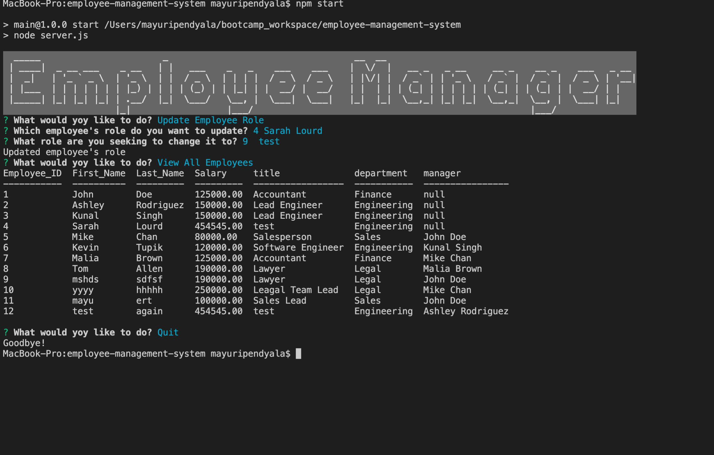

<h1>Employee-Management-System</h1>
  
<p>Employee-Management-System is a Content Management System that stores the user's information in MySQL. This application is used for managing a company's employee data using Node.js, inquirer, and CRUD operations.</p>
  
 ## User Story
 ```
As a business owner
I want to be able to view and manage the departments, roles, and employees in my company
So that I can organize and plan my business
```

 <br>
  
</p>
  <h2>Table of Contents</h2>
  <ul> 
   <li><a href="#Installation">Installation</a></li> 
   <li><a href="#Usage">Usage</a></li>   
                 
  </ul>
  <h2 id="Installation">Installation</h2>                         
  <p>
  <ol>
<li>Clone this repository.<pre><code> git <span class="hljs-keyword">clone</span> <span class="hljs-title">https://github.com/mayuripendyala/employee-management-system.git
</code></pre></li>
<li>Install Nodejs dependencies.<pre><code> npm <span class="hljs-keyword">install</span>
</code></pre></li>
<li>In the root directory of the project, start the app.<pre><code> <span class="hljs-keyword">node</span> <span class="hljs-title">server</span>.js
</code></pre></li>
</ol>
  <h2 id="Usage">Usage</h2>
  <p>This application can be used to create an employee database using CRUD operations. View walk through video here - https://www.youtube.com/watch?v=t-NfloN9c5o
  
  
